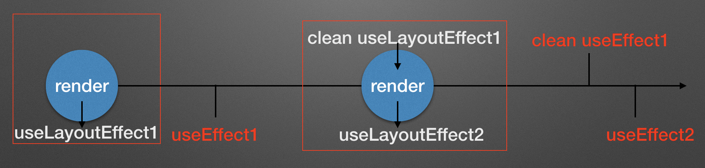

## 体验`useEffect` 和   `useLayoutEffect` 的区别

当我一直很愁页面加一个loading态来防止初始状态和获取数据之后的页面抖动，我以为可以用useLayoutEffect替代useEffect，但其实这么做是不优雅的！

让我们简单看看下面的区别

|  `useEffect`                   |      `useLayoutEffect`              |
| ----------------------------   | -------------------------------     |
|   在浏览器绘制结束之后触发         | useLayoutEffect在浏览器绘制结束之前触发 |
|    异步的                       | 同步的，所以会阻塞页面，React会等它执行完  |

这样就很容易能看出来，`useLayoutEffect` 容易阻塞页面，如果在 `useLayoutEffect` 里面操作很少的话并且还想避免页面抖动可以试用一下，但是官方文档也建议我们最好还是使用useEffect。

如图所示，红框标出的都是同步的

可以看一下这个[实例](https://codesandbox.io/s/eloquent-kilby-29pvh)

例子也更好的解释了先后的执行顺序。

