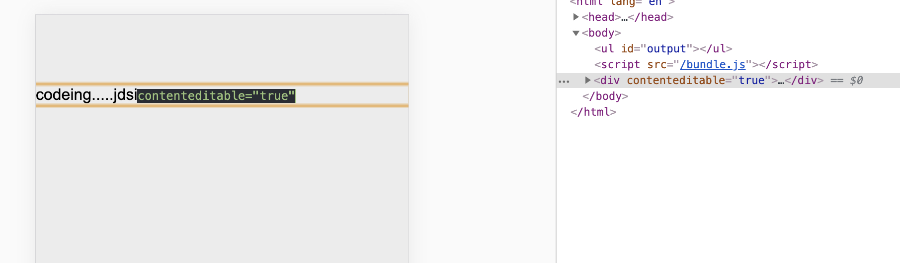
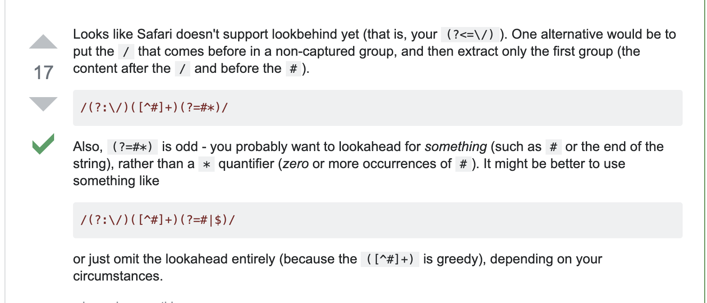
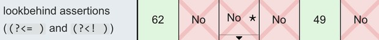

## 小小叙

之前看到`div`标签上加一个 `contenteditable="true"` 的属性，就可以进行简单的文本操作了。

大概让无知的我觉得很神奇。

当然要开发一个满足日常习惯的编辑器还是慢慢长远之路。

这里记录一下组内大佬的[编辑器开发](https://zhuanlan.zhihu.com/p/90931631)

## 兼容性问题

今天发现在Safari上有一个正则的兼容性问题，觉得也是很神奇。

你会发现 `(?<=)` 和 `(?<!)` 在Safari上不被支持。所以如果为了兼容Safari的话，还是避免这种写法

