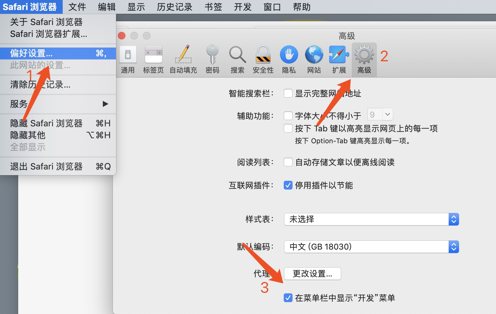
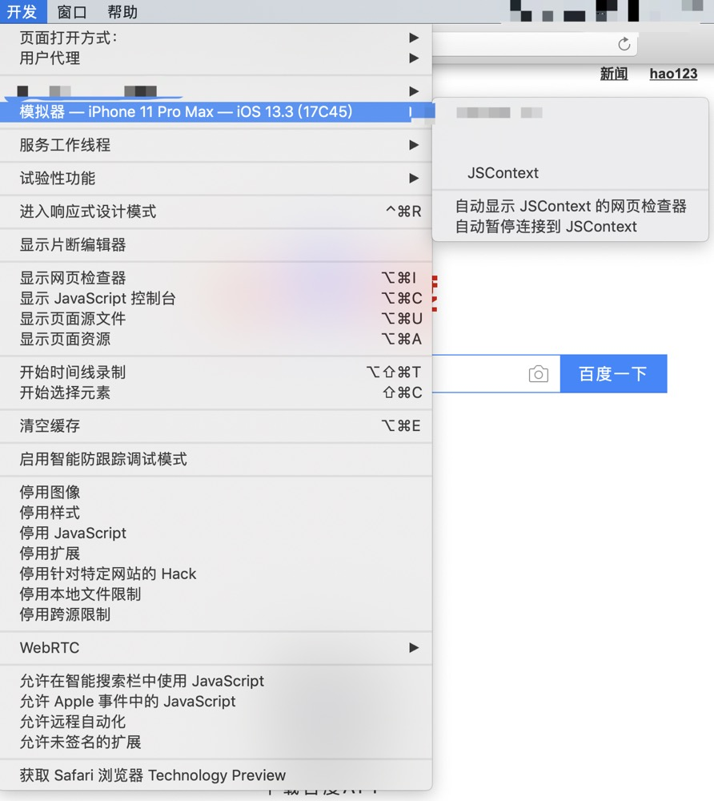

## 前言

移动端的h5开发，就避免不了对ios、安卓这些设备的调试

以前调试兼容性的问题的时候，我会先把代码发到远端然后在测试环境进行查看。

这样的话其实效率是很低的，而且也很不方便。

所以这时候我们可以用电脑进行ios模拟器进行调试。

## ios模拟器调试

### 调试要求

首先确保是mac电脑，然后确保系统已经安装了Xcode

### 打开模拟器

打开模拟器（可以在搜索里面输入 `simulator` 找到） 

选择你所需要模拟的设备和系统。

### 嵌入APP的H5

此时，你需要安装你所需要的app测试包。（当然如果是在浏览器的h5可以直接跳过本步。）

把下载包解压后拖动到模拟器里面进行安装

如果这时候，系统提示未受信任

可以[参考这个](https://support.apple.com/zh-cn/HT204460)进行设置

### 调试

此时打开你要调试的链接

然后打开`Safari`偏好设置中，开启开发菜单。具体步骤为：Safari -> 偏好设置… -> 高级 -> 勾选在菜单栏显示“开发”菜单。

打开电脑里面的 `Safari`，在菜单找到开发调试的入口

此时点击你需要调试的链接，这时候就能看到所属页面的html css js等，和chrome的开发者工具类似，进行类似真机般丝滑的调试了！

