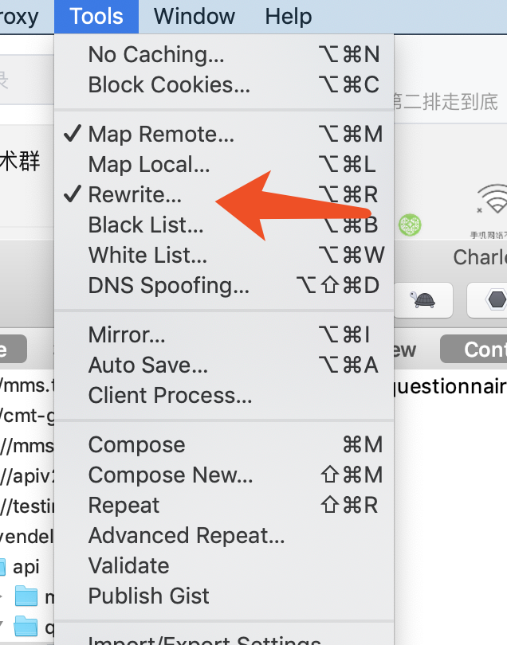
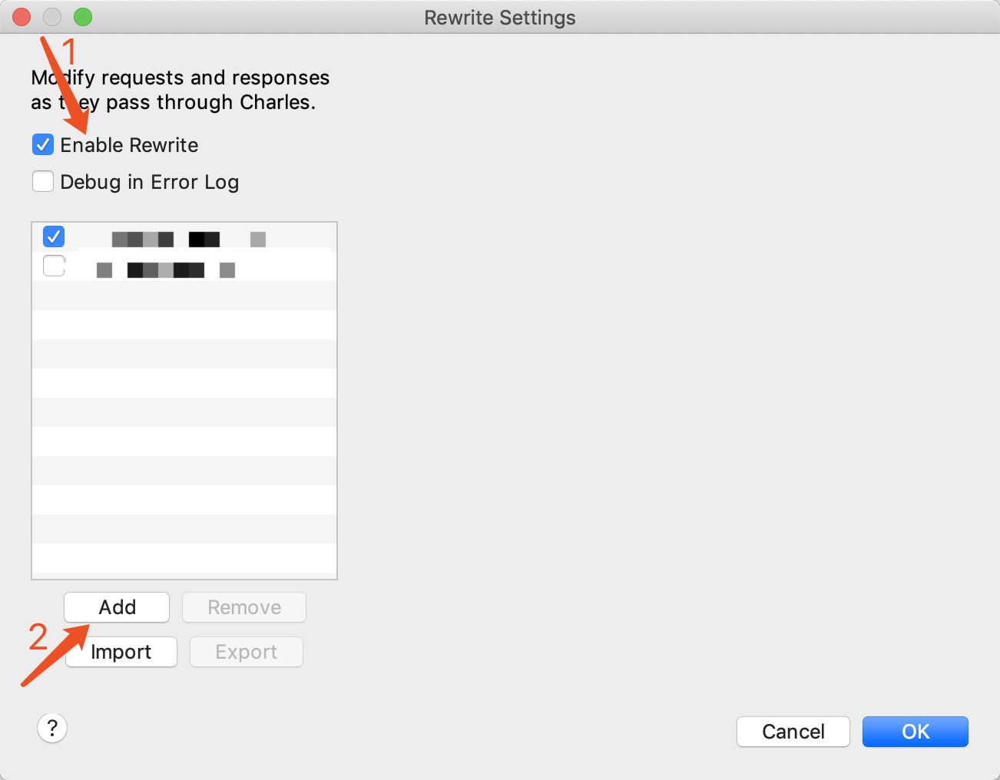
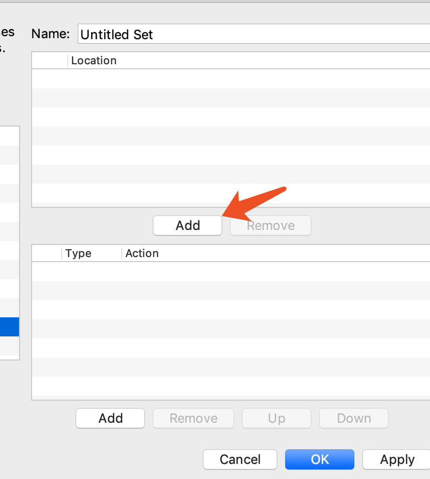
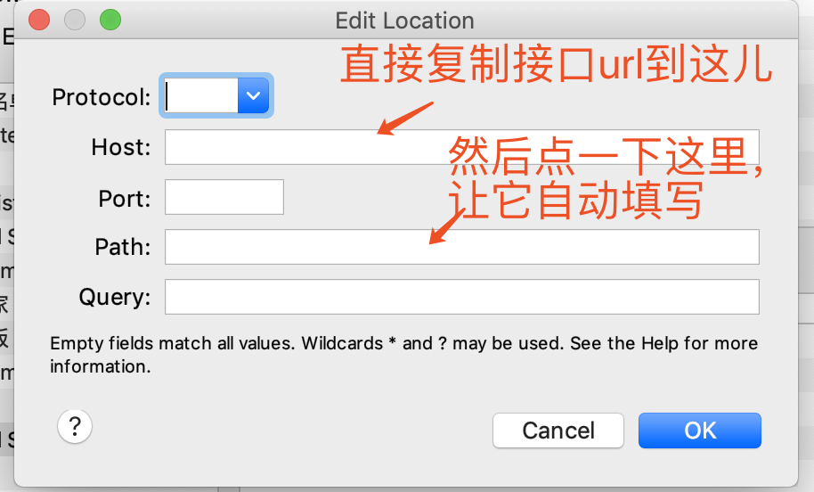
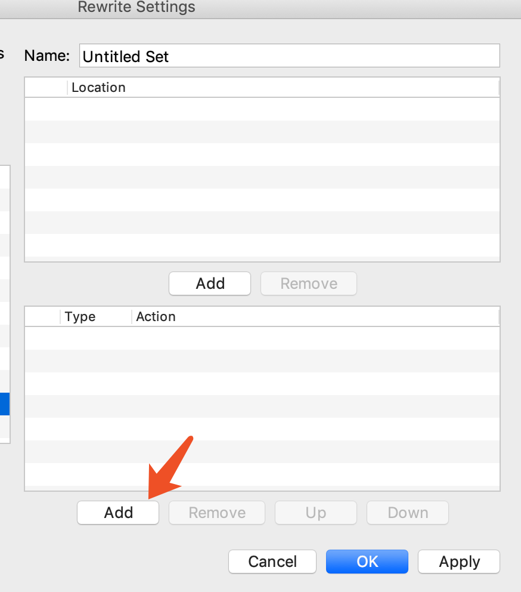
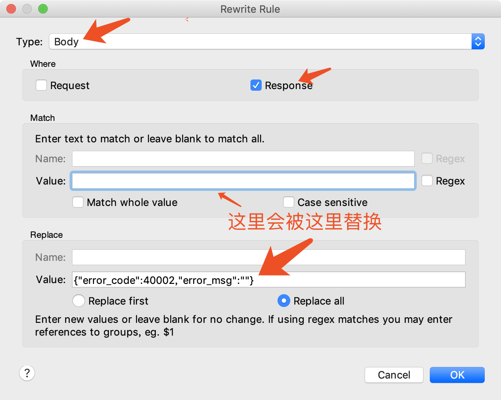
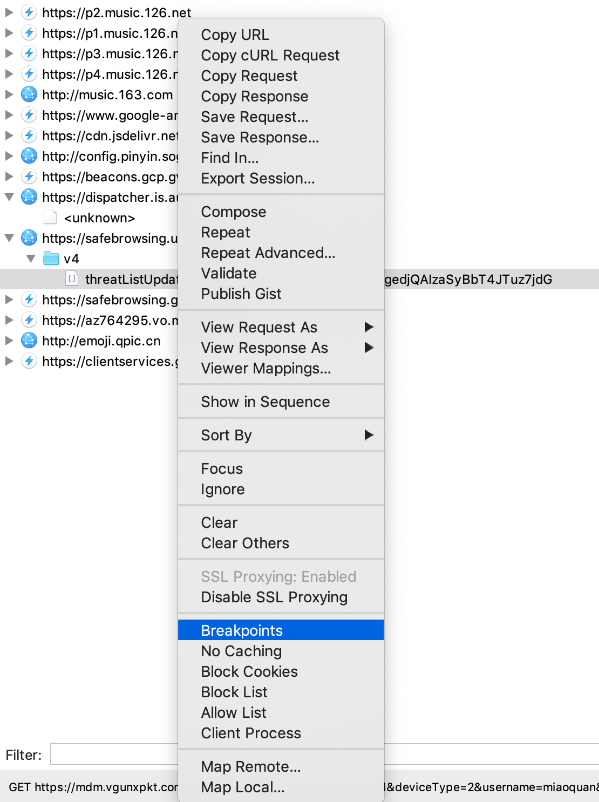
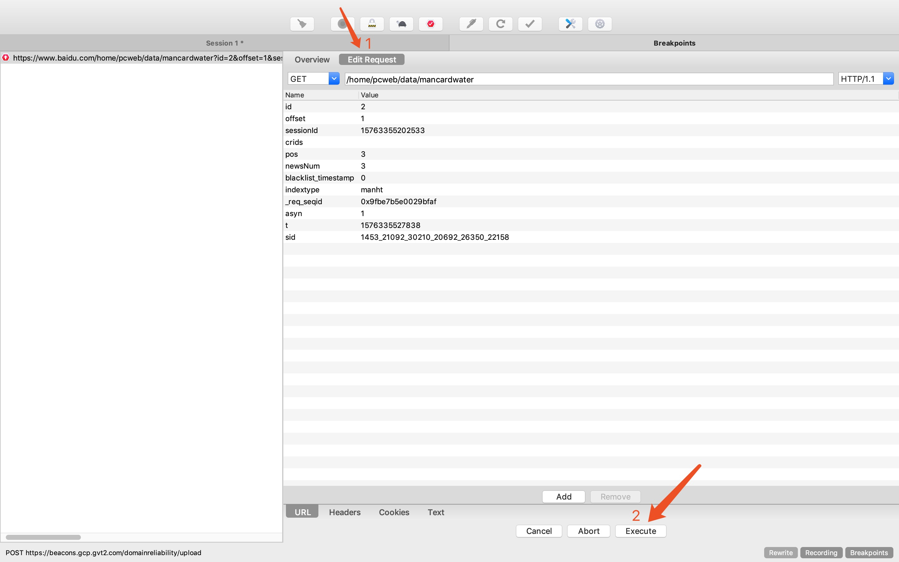
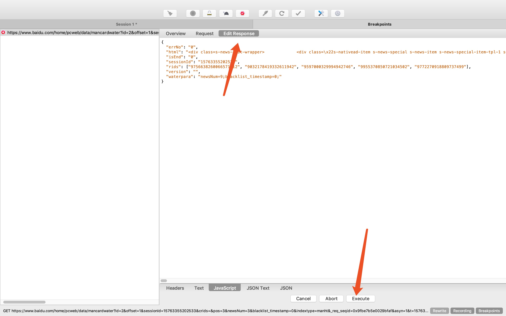

##  前言

移动端的开发离不开charles

当然正常的web开发可能都离不开charles

就说说那些年用charles改过的接口把

## rewrite接口

- 先打开`tool`下的`rewrite`

- 选择`Enable Rewrite`, `add`一条记录，如图所示

- 在`Host`处填写接口的url,随后会自动补全你的接口信息。

- `Type`选择 `Body`, 在`Replace`里面的`Value`里填写你想返回的接口信息

    主要是将`Match`里面的`Value`替换成`Replace`里面的`Value`

## 接口断点

- 找到想要打断点的接口

- 当你在刷新页面的时候，这个接口就会被打断，你可以在里面编辑`response`

    编辑完之后,点击 `Execute`

- 此时你可以在编辑`request`

    然后再点击`Execute`, 就完成了一个接口的周期

`注意：`如果不想给这个接口打断点，记得取消。不然每次都会到这个接口都会被打断
