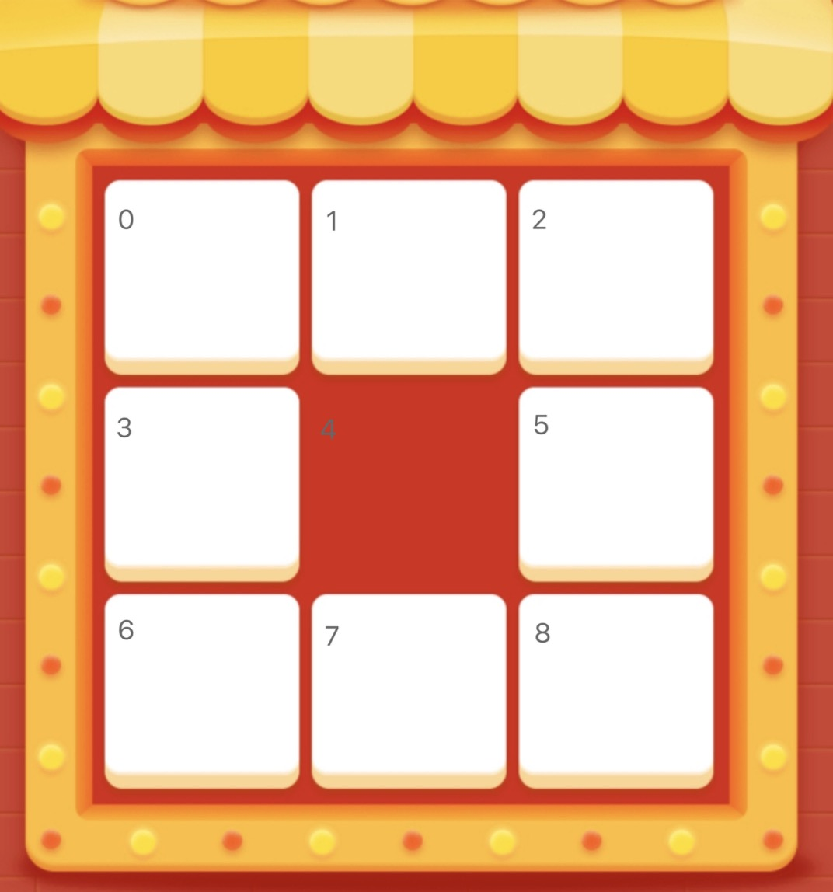
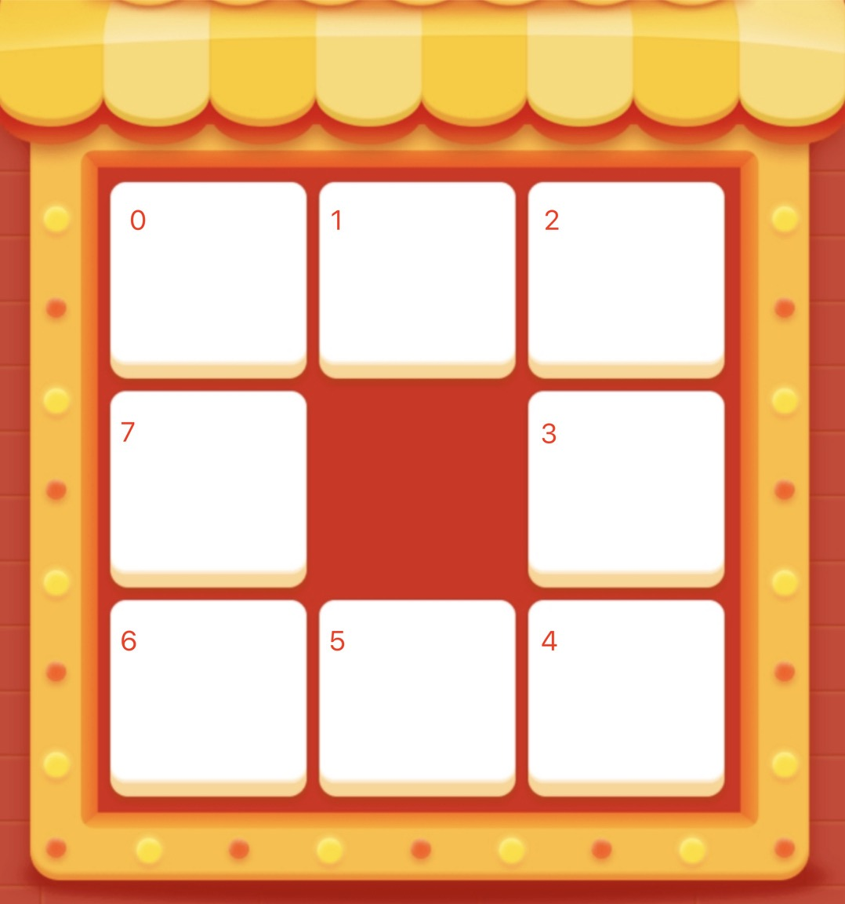

## 九宫格抽奖

整理一下写过的九宫格抽奖吧。

一般抽奖的奖品数据都是从后端返回的。所以九宫格的话，奖品个数是8个。

这个时候奖品数据返回的顺序其实就需要根据前端的实现来定制。

### 思路一： `flex`布局 + 展示和动画顺序的映射


这样3*3 用flex布局再好不过了，一劳永逸。

我们给下图的每个`item`进行标号。

</img>

但是因为4号的位置是抽奖按钮的位置，所以样式需要特殊处理。

因为flex布局的话整个`index`其实是按照如图标的顺序来的。而此时你的动画顺序如果和图标顺序是一样的，就比较方便了。

但是如果是顺时针或者其他的动画顺序，就存在了一个一对一的映射的关系。

以顺时针为例

0->0

1->1

2->2

3->5

4->-1

5->8

6->7

7->6

8->3

4是抽奖，所以赋了-1没有实际意义的数字。

当我们点击抽奖的时候，就依次增加`index`，然后去根据映射得到`activeIndex`，再给`activeIndex`写入不同的样式，我们就能得到一个匀速的动画了。


### 思路二 绝对定位 + 自定义动画顺序

绝对定位就算好距离和位置，直接进行定位。这个的好处是我可以根据动画的顺序来写每个`item`。这样就少去了一一映射的关系。

下图是展示的动画顺序。展示动画的逻辑和思路一是一样的。

</img>


### 变速动画

一般的抽奖效果，可能都是先快后慢。

这个时候就需要去控制定时器的延时大小。

```js
const time = new Date.now()
let speed = 200 //初始速度大小
let diff = 20 //增量 
function draw () {
  const timer = setTimeout(() => {
    if((Date.now() - time) / 1000 - 4 > 0 && 找到奖品) {
      // 根据到了一定的时间并且找了奖品才会停下来
      clearTimeout(timer)
    }
    if ((Date.now() - time) / 1000 - 2 > 0) {
      //减速
      this.speed += diff
    }
    draw()
  }, speed)
}
```


