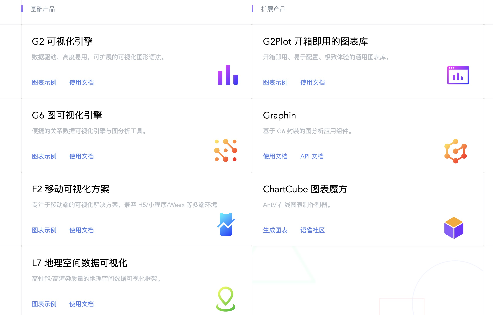

## Antv

`Antv`是蚂蚁金服全新一代数据可视化解决方案。
[官网传送口](https://antv.vision/zh)

主要有以下产品



我们可以看到`f2`是一个专注于移动，开箱即用的可视化解决方案，完美支持 H5 环境同时兼容多种环境（Node, 小程序，Weex）。并且很多图表内容可以进行定制，满足各种可视化需求。

像支付宝、淘票票等里面的一些图表都是引用的`f2`

## antv/f2图表组成

首先我们来了解一个图表的组成

<image src="https://gw.alipayobjects.com/zos/rmsportal/tpfdzWDYmxzHkquTihJe.png#width=600"/>

<image src="https://gw.alipayobjects.com/zos/rmsportal/lUqXwLjgRWhugemcNsqc.png#width=600"/>

## antv/f2数据结构

- 一般的`条形图折线图`都是下面的数据结构

```js
{x: 1, y: 2} //x，y代表两轴数据，可以任意取名字
```

- `层叠图`

```js
{x: 1, y: 2, name: "1"},
{x: 1, y: 2, name: "2"}   // 会根据name来区分层叠的类型颜色
```


- 当有区间的`柱形图`的时候，可以采用数组形式

```js
{x: '分类1', y: [2,5]} //x，y代表两轴数据，可以任意取名字
```

- 饼图

    绘制饼图时，数据集中的每一条记录中必须包含一个常量字段（并且必须是字符串类型）

    ```js
    { name: '胡歌', percent: 0.9, a: '1' }
    ```


