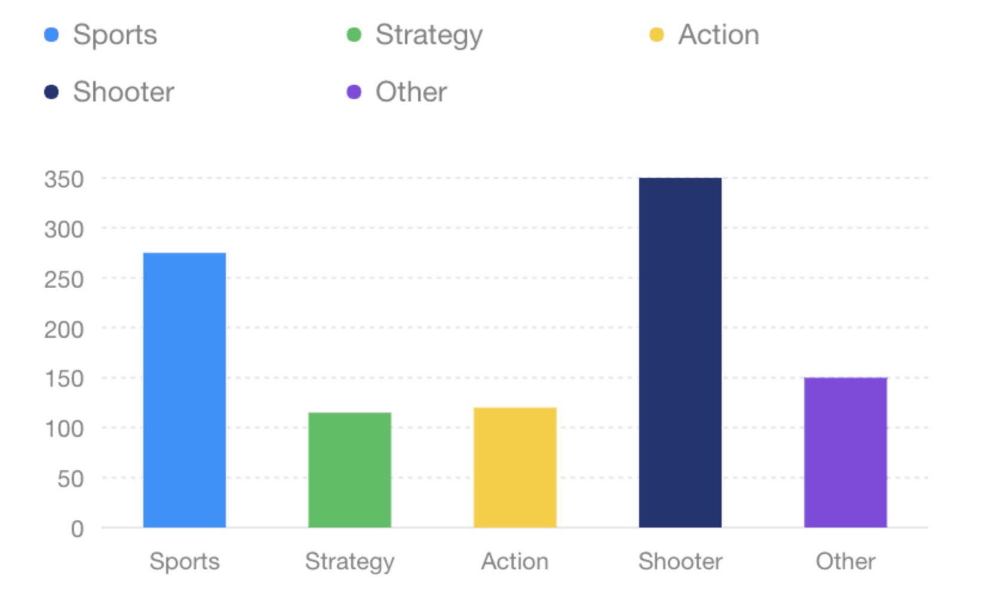

## html中创建antv f2图表

既可以通过将脚本下载到本地也可以直接引入在线资源。

```html
<!-- 引入在线资源 -->
<script src="https://gw.alipayobjects.com/os/antv/assets/f2/3.4.2/f2.min.js"></script>
<!-- 友情提醒：请按需更新版本号。 -->
```

```html
<!-- 引入本地脚本 -->
<script src="./f2.js"></script>
```

- 1.创建canvas标签
- 2.编写图表绘制代码
    - 创建 Chart 图表对象，指定图表 ID、指定图表的宽高、边距等信息；
    - 载入图表数据源；
    - 使用图形语法进行图表的绘制；
    - 渲染图表。

代码如下
```html
<canvas id="myChart" width="400" height="260"></canvas>
<script src="https://gw.alipayobjects.com/os/antv/assets/f2/3.4.2/f2.min.js"></script>
<script>
const data = [
  { genre: 'Sports', sold: 275 },
  { genre: 'Strategy', sold: 115 },
  { genre: 'Action', sold: 120 },
  { genre: 'Shooter', sold: 350 },
  { genre: 'Other', sold: 150 },
];

// Step 1: 创建 Chart 对象
const chart = new F2.Chart({
  id: 'myChart',
  pixelRatio: window.devicePixelRatio, // 指定分辨率
});

// Step 2: 载入数据源
chart.source(data);

// Step 3：创建图形语法，绘制柱状图，由 genre 和 sold 两个属性决定图形位置，genre 映射至 x 轴，sold 映射至 y 轴
chart
  .interval()
  .position('genre*sold')
  .color('genre');

// Step 4: 渲染图表
chart.render();
</script>

```
此时你可以看到这样一张图



## React中创建antv f2图表

在`react`中创建和html步骤相似，唯一区别的是，需要将图表创建挂载的信息放在初始化的时候。

也就是`class`组件的`componentDidMount()`里面，函数式组件的`useEffect(() => {}, [])`中

[代码传送门](https://codesandbox.io/s/black-voice-wbyno)


