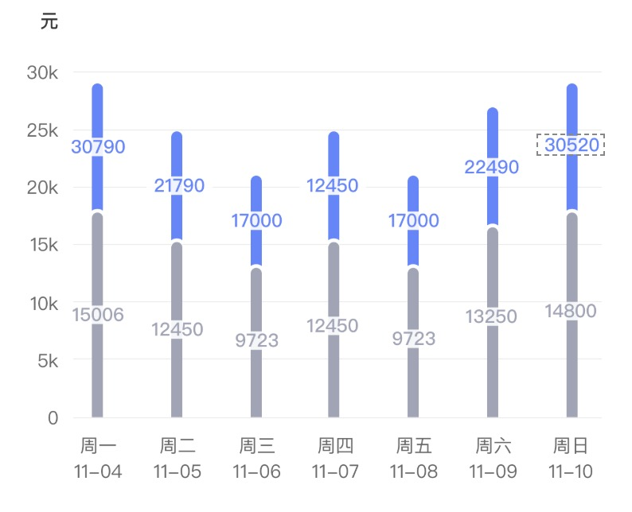

业务中涉及到了层叠折线图和层叠柱状图，其实主要全面的看了文档，就能知道哪些可以自定义实现，主要涉及的配置如下。

## 具体配置

- 当我们需要改变纵轴的显示，可以这样设置

```ts
chart.source(data, {
  //改纵轴显示数据
  value: {
    formatter: function formatter(val) {
      return val / 1000 + "k";
    }
  }
});
```

    [官网实例](https://antv-f2.gitee.io/zh/examples/component/axis#label-callback)


- 不显示点击交互
```ts
chart.tooltip(false);
```

- 取消图例
```ts
chart.legend(false);
```


- 设置网格线为实线
```ts
chart.axis("value", {
  //设置网格线为实线
  grid: {
    lineDash: null,
    stroke: "#e8e8e8",
    lineWidth: 1
  }
});
```

- 标记数据--tag类型

```ts
data.forEach(function(obj) {
  chart.guide().tag({
    position: [obj.date, obj.value / 2],
    content: obj.value,
    offsetX: 13,
    withPoint: false,
    side: 0,
    background: {
      padding: [0, 0], // tag 内边距，使用同 css 盒模型的 padding
      radius: 0, // tag 圆角
      fill: obj.name === "1" ? "#F1F3FE" : "#F5F6F8" // tag 背景色
    },
    textStyle: {
      width: 26,
      fontSize: 10,
      fill: obj.name === "1" ? "#6083FF" : "#9FA4B6"
    }
  });
});
```

    [官网实例](https://antv-f2.gitee.io/zh/examples/component/guide#tag)


- 标记数据--text

```ts
data.forEach(function(obj) {
  chart.guide().text({
    top: true,
    position: [obj.date, obj.value],
    content: obj.value,
    style: {
      textBaseline: "bottom",
      textAlign: "center",
      fill: obj.name === "1" ? "#4D6AFF" : "#9FA4B6", // 文本颜色
      fontSize: "10" // 文本大小
    },
    offsetY: -10
  });
});
```

    [官网实例](https://antv-f2.gitee.io/zh/examples/component/guide#text)


- 自定义图例

    这个可以用canvas画出想要的图例

    [文档传送](https://antv-f2.gitee.io/zh/examples/component/legend#marker)


- 自定义图表形状

    其实可以自定义图表的形状，比如柱状，椭圆状等，因为业务中涉及到了所以了解了一下

    [文档传送](https://antv-f2.gitee.io/zh/docs/api/shape)

## 层叠折线图

原图如下


[代码传送门](https://codesandbox.io/s/suspicious-fog-cbhb6)


## 层叠柱状图

[代码传送门](https://codesandbox.io/s/pensive-tharp-cnmqx)


原图如下


